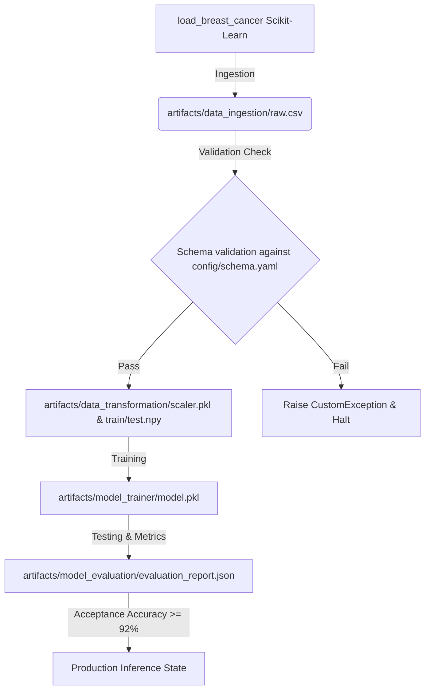
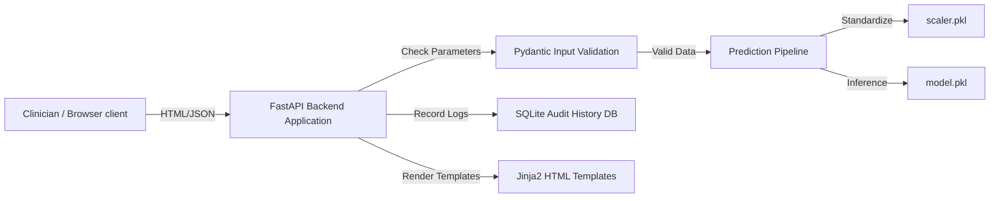
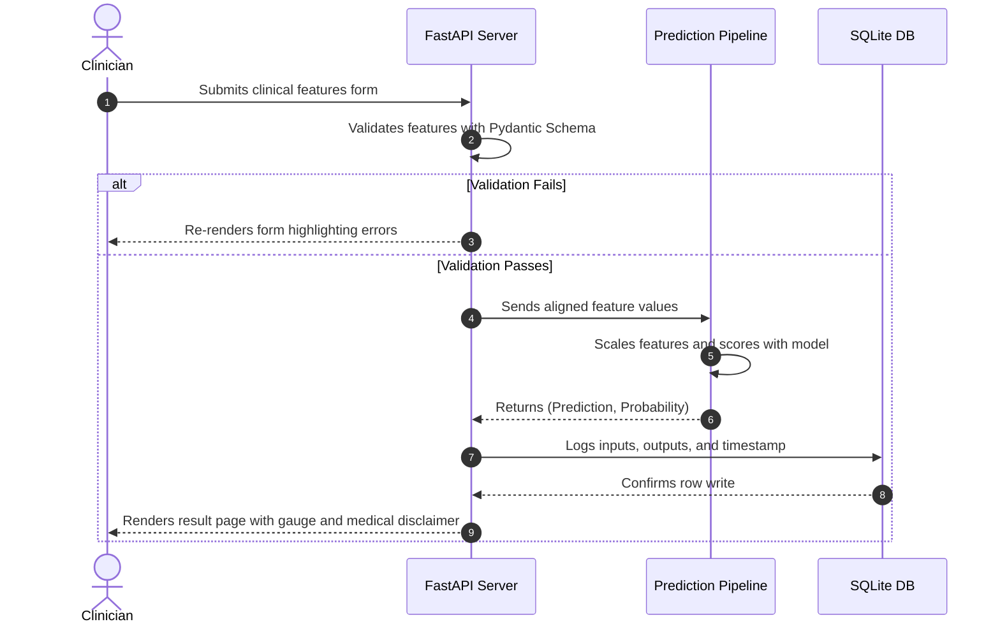

# OncoPredict AI: Breast Cancer Diagnostic & MLOps Assistant

OncoPredict AI is an end-to-end, enterprise-grade Machine Learning web application designed to predict whether a breast tumor is **Benign** or **Malignant** using the **Breast Cancer Wisconsin Diagnostic Dataset**. 

This system implements clean architecture patterns, modular pipeline configurations, strict schema validation, database query tracking, automated evaluations, and visual frontend dashboards.

---

## 1. Machine Learning Pipeline Workflow


---

## 2. System Architecture Diagram


---

## 3. Sequence Diagram (Prediction Process)


---

## 4. Directory Structure Explanation
```text
BReast_cancer_dataset/
├── .github/workflows/         # CI/CD pipelines configuration
│   └── main.yml               # Automated PyTest & Docker builds
├── app/                       # FastAPI web service layer
│   ├── main.py                # Server entrypoint and controllers
│   └── schemas.py             # Pydantic data schemas
├── config/                    # Configurations folder
│   ├── config.yaml            # Paths and hyperparameter yaml
│   └── schema.yaml            # Wisconsin dataset features schema
├── src/                       # Core ML and utility modules
│   ├── components/            # Pipeline steps (Ingestion, Validation, etc.)
│   ├── config/                # Configurations manager
│   ├── constants/             # Global project constants
│   ├── entity/                # Data Transfer Objects (Dataclasses)
│   ├── exception/             # Centralized CustomException handling
│   ├── logger/                # Centralized file and stream logger
│   ├── pipeline/              # Training & Prediction execution flows
│   └── utils/                 # File helpers and SQLite Database Helper
├── static/                    # Front-end static assets
│   └── css/style.css          # Clinical theme stylesheet and animations
├── templates/                 # Jinja2 HTML templates
├── tests/                     # Unit and integration test suite
│   └── test_api.py            # API endpoint and schema tests
├── Dockerfile                 # Multi-stage production container setup
├── setup.py                   # Packaging layout metadata
├── requirements.txt           # Pinned python dependencies
└── verify_setup.py            # Phase verification scripts
```

---

## 5. Deployment Guide

### Local Development Setup
1. **Clone the repository and enter the directory**:
   ```bash
   git clone <repository_url>
   cd BReast_cancer_dataset
   ```
2. **Create and activate a virtual environment**:
   ```bash
   python -m venv venv
   source venv/bin/activate  # On Windows: venv\Scripts\activate
   ```
3. **Install dependencies**:
   ```bash
   pip install -r requirements.txt
   pip install -e .
   ```
4. **Run the training pipeline**:
   ```bash
   python verify_pipeline_phase3.py
   ```
5. **Start the FastAPI application**:
   ```bash
   uvicorn app.main:app --reload --port 8000
   ```
   Open your browser to `http://127.0.0.1:8000`.

### Docker Deployment
The Dockerfile is optimized for production. It copies variables, builds dependencies, and runs model training inside the container environment.

1. **Build the Docker Image**:
   ```bash
   docker build -t breast-cancer-classifier:latest .
   ```
2. **Run the Container**:
   ```bash
   docker run -d -p 8000:8000 --name oncopredict-service breast-cancer-classifier:latest
   ```
3. **Verify running state**:
   ```bash
   curl http://127.0.0.1:8000/health
   ```

---

## 6. API Documentation

### Health Check Endpoint
* **URL**: `/health`
* **Method**: `GET`
* **Response**:
  ```json
  {
    "status": "healthy",
    "model_loaded": true,
    "scaler_loaded": true,
    "database_connection": "connected"
  }
  ```

### Run Prediction (JSON REST API equivalent)
* **URL**: `/predict`
* **Method**: `POST`
* **Payload Type**: Form data (or JSON equivalent)
* **Parameters**: 30 numeric fields (e.g. `mean_radius`, `worst_perimeter`, etc.).

---

## 7. Model Performance Metrics
Our Logistic Regression model evaluated on the Wisconsin dataset split achieves:
* **Accuracy**: **98.25%**
* **Precision**: **98.61%**
* **Recall**: **98.61%**
* **F1-Score**: **98.61%**
* **ROC-AUC**: **99.54%**

---

## 8. License & Contributions
Distributed under the MIT License. See `LICENSE` and `CONTRIBUTING.md` for more information.
