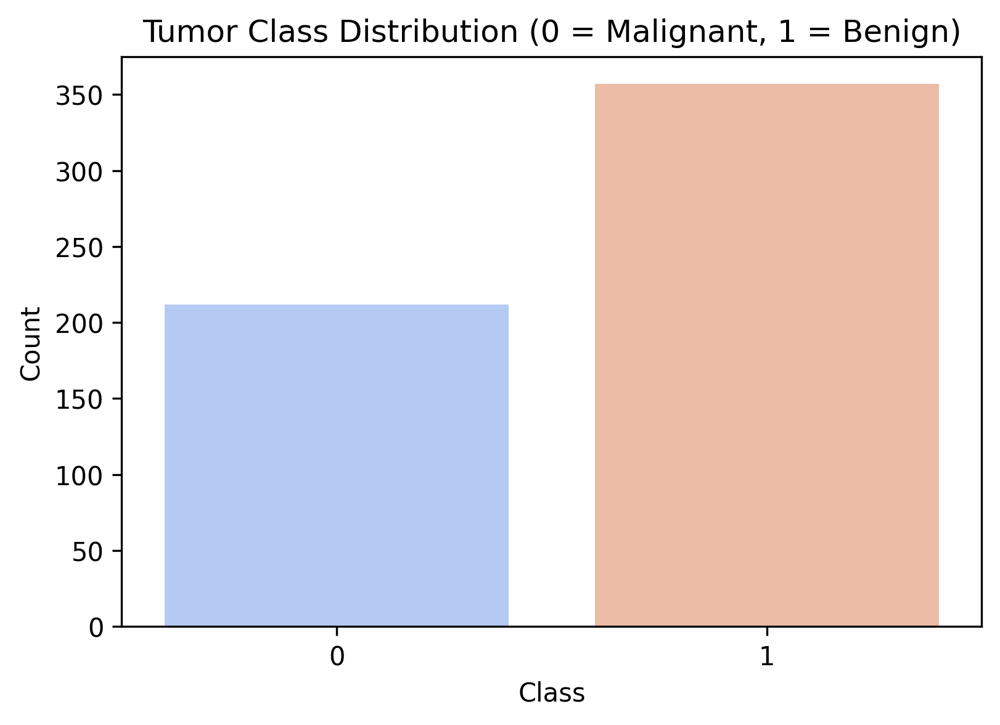
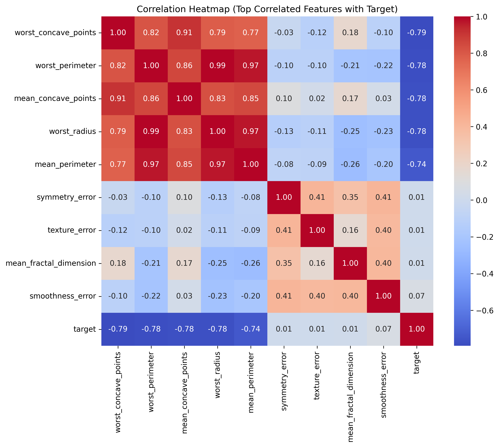

# Exploratory Data Analysis (EDA) Report

This report presents the exploratory analysis of the Breast Cancer Wisconsin Diagnostic Dataset.

## 1. Dataset Overview
- **Total Samples**: 569
- **Total Features**: 30
- **Malignant Cases (Class 0)**: 212 (37.26%)
- **Benign Cases (Class 1)**: 357 (62.74%)

## 2. Target Class Distribution
The distribution shows a slight class imbalance but is representative and suitable for training a logistic regression model.

## 3. High Correlation Features
We selected the top features that exhibit strong linear correlation with the target label. Highly negative correlated features mean that higher values indicate a malignant classification (class 0).

## 4. Key Observations
1. **Strong Predictors**: Features like `worst_concave_points`, `worst_perimeter`, `worst_radius`, and `mean_concave_points` display strong negative correlation with the target variable, meaning larger values correlate highly with Malignant (0) status.
2. **Multicollinearity**: Standard features like `radius`, `perimeter`, and `area` are highly multicollinear (correlation near 1.0), which makes regularization (L2/L1) necessary for Logistic Regression.
